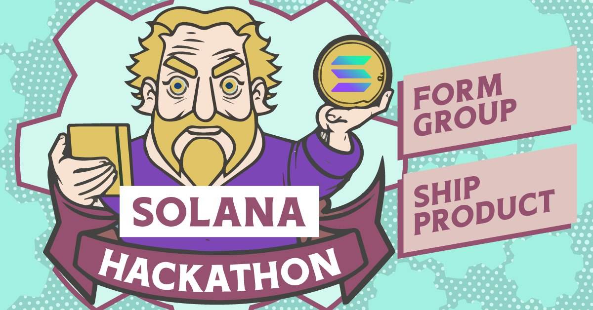

# Workshops

## 機會黎啦飛雲！Solana Hackathon Workshop 即將於三月開辦🤩！

<figure><figcaption></figcaption></figure>

想要更深入了解 Solana Hackathon，單拖或組隊開發領⭐金貨💰事不宜遲。為期個多月課程將函蓋 Solana 基本原理到進階開發技巧。透過與專業導師團隊教學相長、深入淺出，引領參加者進入 Solana 專業開發領域。

**對象︰**

🔥有火！會出 product 的 developers！

💻願意學習、實踐 Solana 開發技術

**內容**

* Hackathon（駭客松）專案開發指導

* Solana 運作原理、共識機制與效能

* 資料儲存：帳户模型

* 操作單位：交易和指示

* 代幣標準（同質、非同質）

* Solana 程序 (Smart Contract)

* 安全考量

**特色**

* 真槍實彈，以實踐印證理論

* Solana 基金會認可官方開發工作坊

* 首次於香港舉辦，機會難逢，是早著先機增值自己的好機會

* 成人可獲 50% 學費回贈，現屆學生更可獲 100% 學費回贈！

* 提供錄影回放，無須擔心錯過精彩內容

* 導師課後支援、小組討論

**語言︰** 粵語講授，中/英語教材

**日期/時間︰**

    12/03, 14/03, 16/03

    19/03, 21/03, 23/03

    (逢星期二、四 19:00-21:00)

    (逢星期六 14:00-16:00)

**地點︰** 九龍區

**費用:**

**早鳥價 (時段待定)**

    成人 HKD$5,000

    學生 HKD$1,000

**富鳥價 (時段待定)**

    成人 HKD$8,000

    學生 HKD$1,600

💰簽到出席當中 [x] 小時工作坊並成功送遞專案參加 Solana Hackathon，可獲 50% 學費回贈，提供現屆學生證明更可獲 100% 學費回贈！

**流程**

1. 線上簡介會(3月9日 20:00，星期六)

2. 早鳥價報名

3. 富鳥價報名

4. 開課 (3月)

5. 遞交作品 (4月初)

**簡介會報名** ➡️ [https://forms.gle/LfKADKsm8gZoCTLq6](https://forms.gle/LfKADKsm8gZoCTLq6) ⬅️

