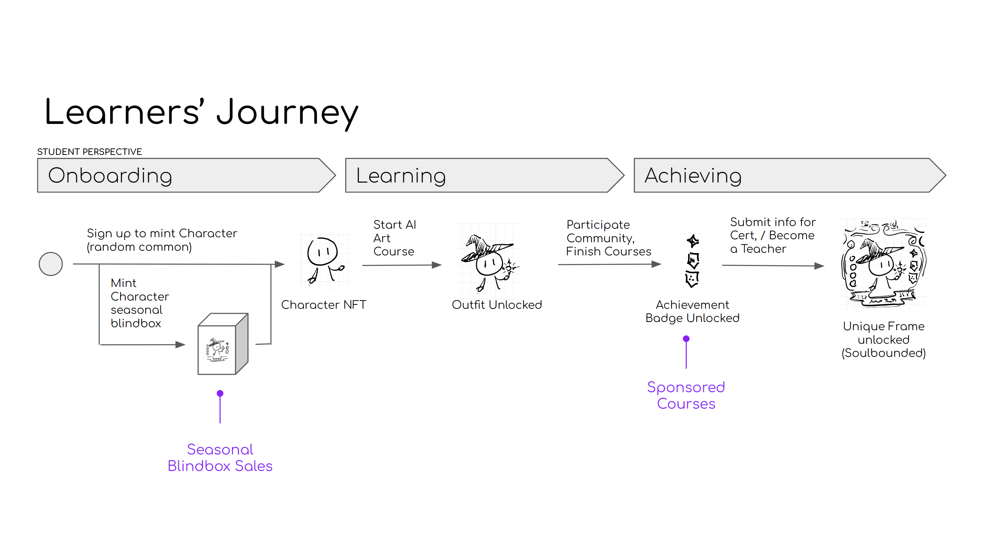

# Learners' NFT Avatars

It's not the first time in the history that projects reinventing education through gamification, yet given that [all the new challenges](../overview/our-ecosystem/) that we are now facing during 2023, it's time to try something new again. With the rising adoption of Web3, Solearna prioritizes its focus to make learners' learning experience both motivational and meaningful again by leveraging all the new technologies that Web3 could offer, starting from NFT.

## Learners' Avatar

<figure><figcaption></figcaption></figure>

Learning is always a lonesome process. Student who pursues knowledge in Web2 era usually lack a way to be recognized for their effort except a digitalized certificate. What if, their effort could be summarized and visualized as an public avatar?&#x20;

We thereby introduce Learners' Avatar - a character which lives on chain and grows along with students learning progression.&#x20;

## Learners' Journey

<figure><figcaption></figcaption></figure>

### Onboarding

Everyone who joins Solearna could mint a `common Character NFT`, which can be used as their basic character to join any courses offered through Solearna and start growing their Avatar. This registration service is free (except some gas fee during minting).

Seasonally, Solearna will also publish limited themed characters. People who wants to unlock unique characters for their Avatar can get those through blind box sales or secondary market.

### Learning

When students start learning through Solearna, their participation will yield them different POAPs ([Proof of Attendance Protocol](https://poap.xyz/)) that are address-binded and untradable, to abstract their learning journey.

* Character Outfits - earned through registering certain stream of courses. Each of those will have unique set of outfits, for example,, programming course will yield a Wizard Outfit POAP. Mastering a course will evolve the Outfit to a higher level with different visual as well !&#x20;
* Badges - participating in Solearna community, events, study groups, and even sponsored courses (from 3rd parties) will yield unique Badges that students can show them off on their Avatar.

On the other hand, an unique type of NFT, (Avatar) Frame, will sometimes be offered for honorable members (e.g. OGs, or even teachers), to emphasize their contribution to Solearna.&#x20;

### Achieving

With all the interesting elements available, the learning journey cannot be completed without letting student to show off their effort and achievement. Later this year, Solearna will launch an App that natively connect Web3 and learning modules such that students not only could enjoy a more seamless experience, but also will enable them to customize their Avatar with all the Outfits, Badges and Frames that they have earned - which will be sharable on  any media.&#x20;

